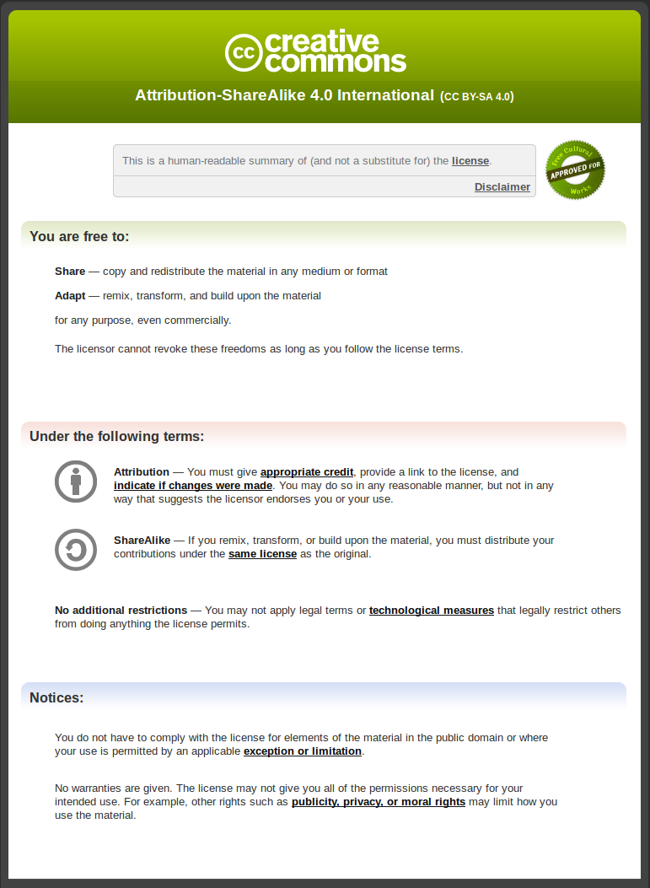

# License

Copyright 2020 Bharath Kumar.

Except as otherwise noted, the content of this workshop is licensed under the Creative Commons Attribution-Share Alike 4.0 International License and the code samples are licensed under the Apache 2.0 License.

“Network Hunt” CTF is based on work created and shared by James Sullivan and used according to terms described in the MIT license.

All the packet header illustrations are reproduced work created and shared by Matt Baxter as seen at [Nmap reference book](https://nmap.org/book/tcpip-ref.html) 

