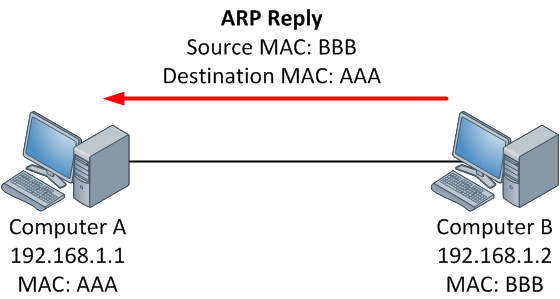

# Address Resolution Protocol(ARP) protcol 

Understanding ARP protocol is important to solve some challenges that's why we have an entire section for this protocol. We'll use this section as reference when we are solving relavant challenges.

- ARP is used for mapping a network address (e.g. an IPv4 address) to a physical address like an Ethernet address (also named a MAC address).
- ARP has been implemented with many combinations of network and data link layer technologies but the most common being IPv4 over Ethernet.
- The purpose of ARP is to find out the MAC address of a device in your Local Area Network (LAN), for the corresponding IPv4 address, which network application is trying to communicate.

## ARP resolution

### Step 1:

When a source device want to communicate with another device, source device checks its ARP cache to find it already has a resolved MAC Address of the destination device. If it is there, it will use that MAC Address for communication. To view your Local ARP cache. (arp -a displays local arp cache)

### Step 2:

If ARP resolution is not there in local cache, the source machine will generate an ARP request message(who-has), it puts its own data link layer address as the Sender Hardware Address and its own IPv4 Address as the Sender Protocol Address. It fills the destination IPv4 Address as the Target Protocol Address. The Target Hardware Address will be left blank, since the machine is trying to find that.

### Step 3:

The source broadcast the Address Resolution Protocol (ARP) request message to the local network.

### Step 4:

    The message is received by each device on the LAN since it is a broadcast. Each device compare the Target Protocol Address (IPv4 Address of the machine to which the source is trying to communicate) with its own Protocol Address (IPv4 Address). Those who do not match will drop the packet without any action.

### Step 5:

When the targeted device checks the Target Protocol Address, it will find a match and will generate an Address Resolution Protocol (ARP) reply message. It takes the Sender Hardware Address and the Sender Protocol Address fields from the Address Resolution Protocol (ARP) request message and uses these values for the Targeted Hardware Address and Targeted Protocol Address of the reply message.

### Step 6:

The destination device will update its Address Resolution Protocol (ARP) cache, since it need to contact the sender machine soon.

### Step 7:

Destination device send the Address Resolution Protocol (ARP) reply message and it will NOT be a broadcast, but a unicast.

### Step 8:

The source machine will process the Address Resolution Protocol (ARP) reply from destination, it store the Sender Hardware Address as the layer 2 address of the destination.

### Step 9:

The source machine will update its Address Resolution Protocol (ARP) cache with the Sender Hardware Address and Sender Protocol Address it received from the Address Resolution Protocol (ARP) reply message.
