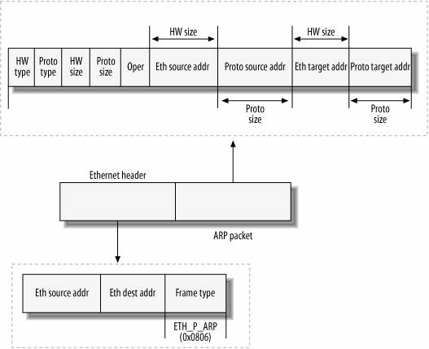

# Packet Headers

This workshop is about crafting packets so it makes sense to spend some time in understanding what packets are and how they are structured.

Illustrations on this page are reproduced work created and shared by Matt Baxter as seen at [https://nmap.org/book/tcpip-ref.html](https://nmap.org/book/tcpip-ref.html)

## IP header 

## TCP header

  TCP flag | Binary    | Decimal | TCP Dump syntax
  ---------|-----------|---------|-------------------
  URG      |  00100000 |  32     |  'tcp\[13\] == 32'
  ACK      |  00010000 |  16     |  'tcp\[13\] == 16'
  PSH      |  00001000 |  8      |  'tcp\[13\] == 8'
  RST      |  00000100 |  4      |  'tcp\[13\] == 4'
  SYN      |  00000010 |  2      |  'tcp\[13\] == 2'
  FIN      |  00000001 |  1      |  'tcp\[13\] == 1'

SYN-ACK = 00010010 = 18
RST-ACK = 00010100 = 20

TCP flags mnemonic - **U**nskilled **A**ttackers **P**ester **R**eal **S**ecurity **F**olks

## UDP header

## ICMP header

## ARP header

