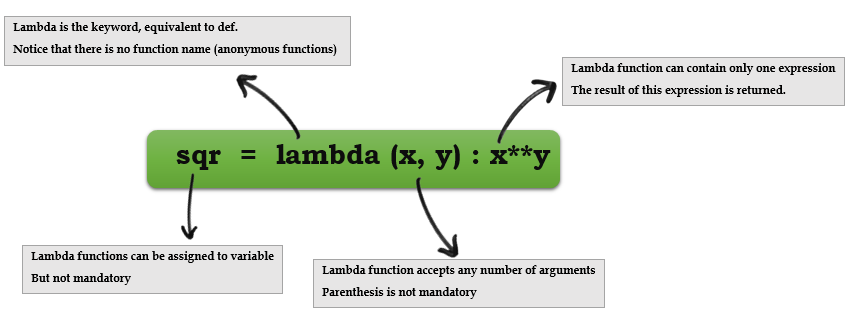

# Python Concepts

This training assumes that you already know basics of Python. This section by no means is an introduction to Python.

In this section we are covering Python concepts that are essential when using Scapy. If you need a quick intro to Python then you can use the content at [https://cs.stanford.edu/people/nick/python-in-one-easy-lesson/](https://cs.stanford.edu/people/nick/python-in-one-easy-lesson/)

## List comprehensions

- A list comprehension is a compact way to write an expression that expands to a whole list
- List comprehension can almost substitute for the lambda function especially as `map()`, `filter()` and `reduce()`


```
# compute a list of their squares of elements in a list
nums = [1, 2, 3, 4]

squares = [ n * n for n in nums ]   ## [1, 4, 9, 16]
```

```
>>> port_numbers = [22,25,80,139,443]
>>> [k for k in port_numbers]
[22, 25, 80, 139, 443]
>>>
>>> numbers = [2,4,6,8] 
>>> [k*2 for k in numbers]
[4, 8, 12, 16]
```
    
You can add an if test to the right of the for-loop to narrow the result. The if test is evaluated for each element, including only the elements where the test is true.

```
>>> port_numbers = [22,25,80,139,443,8080,9999,55555]
>>> 
>>> [k for k in port_numbers if k<1023]
[22, 25, 80, 139, 443]
```

## Lambda functions

Syntax: `lambda arg1, arg2, …argN : expression using arguments`.




- Python supports the creation of anonymous functions (i.e. functions that are not bound to a name) at runtime, using a construct called “lambda”.
- Lambda functions take any number of arguments but only has one expression, the result of this expression is returned.

>>> def f (x): return x**2
... 
>>> print f(8)
64
>>> 
>>> g = lambda x: x**2
>>> 
>>> print g(8)
64

- Lambda functions can be used anywhere a function is expected, not necessary to assign it to a variable
- You can pass lambda functions to other functions to do stuff(for example lambda function as key to `sorted()`)


- Extracting numbers that are multiples of 3
- One element of data structure(a list here) gets passed to the lambda function at a time
- Lambda function can only have one expression
- `filter` is a built-in function in Python that take a function and a data structure as arguments, passes one element of data structure at a time to the function

```
>>> mult3 = filter(lambda x: x % 3 == 0, [1, 2, 3, 4, 5, 6, 7, 8, 9])
>>> mult3
[3, 6, 9]
```

Sort elements in list by last character.

```
>>> lis = ['az', 'bbbbbbt', 'cccx']
>>>
>>> sorted_by_last = sorted(lis, key = lambda(x): x[-1] )   
>>>
>>> sorted_by_last
['bbbbbbt', 'cccx', 'az']
```

Extracting privileged ports(under 1024) from a list of port numbers using lambda function.

```
>>> open_ports = [1,20,21,25,80,443,1639,4444,6798]
>>> 
>>> privileged_ports = filter(lambda x: x <1024, open_ports)
>>> privileged_ports
[1, 20, 21, 25, 80, 443]
>>> 
```

If you are not comfortable with using lambda functions, you can simply use normal functions.

```
>>> def extract_priv_ports(port_number):
...     if port_number < 1024:
...         return port_number
>>>
>>> privileged_ports = filter(extract_priv_ports, open_ports)
>>> privileged_ports
[1, 20, 21, 25, 80, 443]
>>> 
```

> Lambda funtions are good when they are short and as throw away functions. If you plan on doing anything remotely complex with it, put lambda away and define a real function.
