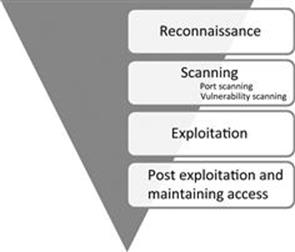

# Host Discovery

Two steps to basic network reconnaissance.

    - Host Discovery
    - Service Discovery (Port Scanning)



## Host Discovery

- First step to network recon. Goal is to reduce a large set of IP ranges into a list of active or interesting hosts. (A 10.0.0.0/8 network can accomdate 16777200 hosts)
- Port scanning is loud and also expensive on time and resources. More targets; More chances of being caught by an IDS.
- Stringent narrowing down might lead to missing interesting targets. Liberal narrowing down can result in large set of machines to scan. Strike a balance based on the requirements.

### TCP SYN Ping

- Send an empty TCP packet with only SYN bit set
- SYN/ACK or RST in response indicates that a machine is up and running

```
>>> ans,unans=sr( IP(dst="192.168.1.*")/TCP(dport=80,flags="S") )
>>> ans.summary( lambda(s,r) : r.sprintf("%IP.src% is alive") )
192.168.56.101 is alive!
```

### TCP ACK Ping

- Send an empty TCP packet with only ACK bit set
- Unsolicited ACK packets should be responded with RST which reveals a machine
- SYN ping and ACK ping might seem redundant but most of the stateless firewalls won’t filter unsolicited ACK packets so it’s a better approach to use both ping tecnhiques

```
>>> ans, unans = sr(IP(dst='192.168.56.99-105')/TCP(dport=80, flags='A'))
Begin emission:
Finished to send 7 packets.
......................^C
Received 25 packets, got 1 answers, remaining 6 packets
>>> 
>>> ans.summary(lambda(s,r): r.sprintf('{IP: %IP.src% is alive}'))
 192.168.56.101 is alive
>>> 
```

### UDP Ping

- Send UDP packet to the given ports with or without payload, though protocol specific payload makes the scan more effective
- Choose a port that’s most likely closed (Open UDP ports might recieve empty packets but ignore them)
- ICMP port unreachable signifies that the machine is up

### IP Protocol ping

- Send multiple packets with different protocol numbers set in their IP header, append proper protocol headers
- Look for either responses using the same protocol as a probe, or ICMP protocol unreachable, either of the responses will signify a machine is alive

### ARP Ping

- ARP Ping is employed when discovering active hosts on the same network/LAN
- Faster and reliable because it operates on Layer 2 by using only ARP
- ARP is the backbone protocol for any Layer 2 communication so always employ ARP ping when discovering hosts on local network
- ARP doesn’t exist in IPv6 standard. For the equivalent, use Neighbor Discovery Protocol techniques instead.

```
>>> ans,unans=srp(Ether(dst="ff:ff:ff:ff:ff:ff")/ARP(pdst="192.168.56.0/24"),timeout=2)
Begin emission:
**Finished to send 256 packets.

Received 2 packets, got 2 answers, remaining 254 packets
>>> 
>>> ans.summary(lambda (s,r): r.sprintf("%Ether.src% %ARP.psrc%") )
08:00:27:7b:2a:a9 192.168.56.100
08:00:27:37:86:85 192.168.56.101
>>> 
```

### ICMP Ping

- ICMP scan involves the standard packets sent by the ubiquitous ping program
- Send an ICMP type 8 (echo request) packet to the target IP, a ICMP type 0 (echo reply) indicates that the target is alive
- Unfortunately, many hosts and firewalls now block these packets so a basic ICMP scan is unreliable
- ICMP also supports timestamp request(13), and address mask request(17) which can reveal the availabilty of a machine

```
>>> ans,unans=sr(IP(dst="192.168.56.99-110")/ICMP())
Begin emission:
Finished to send 12 packets.
Received 170 packets, got 1 answers, remaining 11 packets
>>> 
>>> ans.summary( lambda(s,r) : r.sprintf("{IP: %IP.src% is alive}") )
192.168.56.101 is alive
```

## Exercise time - network sweeping

Please solve Exercise 1 - Misc exercises
