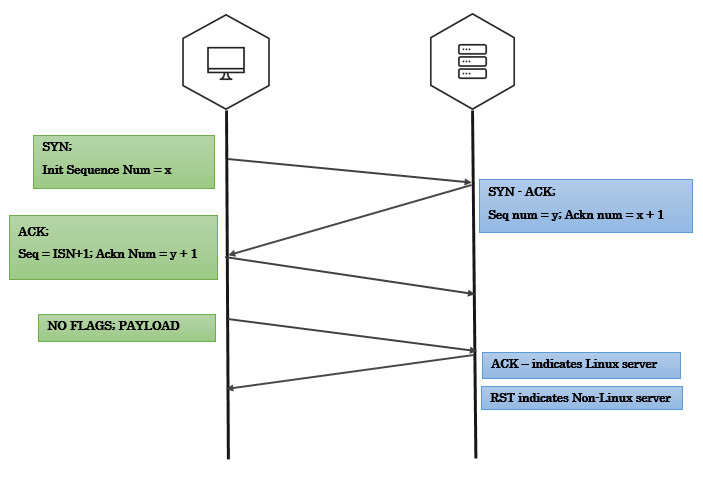

# Remote OS Detection

There are two approaches to finger printing remote Operating Systems:

**Active OS finger printing**

Active finger printing is when attacker sends a series of TCP and UDP packets to the remote host and examines practically every bit in the responses. After the tests the results are compared against the general behaviour of Operating Systems for a match.

Nmap is the most popular active OS detection tool. Nmap probes a target with large number of well crafted packets and the results are compared against Nmap’s database of OS fingerprints (nmap-os-db).

For more details on Nmap’s active OS detection techniques - [https://nmap.org/book/man-os-detection.html](https://nmap.org/book/man-os-detection.html)


**Passive OS fingerprinting**

Passive OS finger prining is analyzing network traffic to detect what operating system the client/server are running. This possible because of the difference in TCP/IP stack implemention in various operating systems. P0f is a popular passive finger printing tool with large database of finger prints.

For more details on p0f finger printing - [http://lcamtuf.coredump.cx/p0f3/](http://lcamtuf.coredump.cx/p0f3/)

## Active OS finger printing

### Differences in protocol implementations

RFC 793 says: “ACK (1 bit) – indicates that the Acknowledgment field is significant. All packets after the initial SYN packet sent by the client should have this flag set”.

But, IP stacks are written for different OSs by different people who read the RFCs and then write their interpretation of what the RFC outlines into code. This leads to a difference in how IP stacks are implemeted across OSes.

#### Linux implementation

Linux kernel 2.4+ accepts and acknowledges a segment in an established session where no TCP flags are set and where the segment has payload No other well known current operating system accepts this same segment.

This behaviour of Linux network stack is complied into the kernel so it isn’t easy to alter it. This makes it a very foolproof technique for remote Linux OS detection.

**The Technique:**



- Establish a TCP three-way handshake with the target
- All we have to do after handshake is to create a segment with no TCP flags and add some payload and send it

```
payload="just some data"
data_packet = TCP(sport=1500, dport=80, flags="", seq=102, ack=my_ack)    # Notice that we explicitly mentioned to not set any flags
send(ip/data_packet/my_payload)
```

- If the target is Linux server(2.4+ kernel), you’ll see an ACK bit set in the response
- In case of other Operating Systems, the response will most likely be a RST packet

## Passive OS fingerprinting

### TTL & Window size analysis

