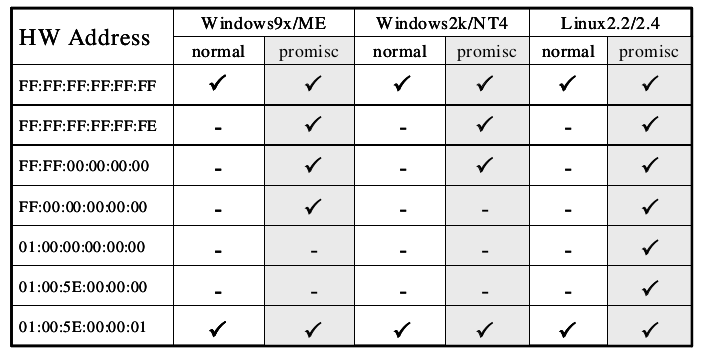

# Promiscuous mode detection

> You have an attacker sitting in your internal network, listening to all the traffic, you are running against time to find them! What do you do?

## Promiscuous mode

- Promiscuous mode allows a network device to intercept and read each network packet that arrives in its entirety.
- Unlike Monitor mode, in promisc mode the listener has to be connected to the network.
- Some tools that use promiscuous mode - Wireshark, Tcpdump, Aircrack-ng, cain and abel, Snort, VirtualBox etc
- Extremely effective because of it’s passive nature.

**Enable promiscuous mode**

```
$ sudo ifconfig <iface> promisc   
```

**Disable promiscuous mode**

```
$ sudo ifconfig <iface> -promisc   
```

## Detecting promisc node - The idea

All the packets recieved by promisc NIC are passed on to the kernel, so the basic idea of detection is to send specially crafted packets that may trick the system kernel to respond to packets that it is not supposed to respond to in normal mode.

Fake ARP request packets, ICMP Ping(echo request) with wrong MAC but right IP address could do the job.

### Hardware filter

Normally, NIC of a machine filters and accepts only packets that have destination address set to the NIC’s own hardware address, broadcast address (FF FF FF FF FF FF), and multicast address 1(01 00 5E 00 00 01). Let’s call this a hardware filter, where packets are filtered by NIC based of destination address.

> In promiscuous mode, NIC is set to accept every packet that it recieves, like it has no hardware filtering.

- Using the above information it should be easy to find promisc nodes, right?

Just send packet using a destination address that is supposed to be filtered by hardware filter when in normal mode, only if a machine is in promisc mode, it would pass the packet to kernel without hardware filtering and would respond to that packet.
    
- Let’s send an ARP packet to destination 00:00:00:00:00:01. What happens??

An ARP packet needs Ether header. You only have to set `dst` field in Ether header (to our selected address) and `pdst` field in ARP header (to the target IP address), all the other fields are filled in by Scapy.

```
promisc_test = Ether(dst='00:00:00:00:00:01')/ARP(pdst='192.168.56.101')
```

If our logic was correct, a promisc machine should reply to this packet but we didn’t get a reply. It could be either that the target is not in promisc mode or there is some more filtering going on.

### Software Filter

- Operating system kernels implement a filter, let’s call it software filter.
- Even though a packet passes through hardware filter, kernel is implementing another filter and this mechanism is filtering out some other addresses so we are not getting a response.

### Breaking Hardware filter & Software filter

The hardware filter usually blocks packets that are not supposed to arrive to the system kernel.

We need to craft a packet that is:

  - Blocked by the hardware filter in normal mode, only passed to kernel in promisc mode.
  - Should be able to pass the software filter.

#### Final test

The following table is a collection of special set of MAC addresses and the machines behaviour when it recieves a packet with one of these addresses as destination in the Ethernet header.

A machine in promisc mode will reply to the below packet (given the `pdst` matches it's IP)

```
promisc_test = Ether(dst='FF:FF:FF:FF:FF:FE')/ARP(pdst='192.168.56.107')
```

If you notice, only a Linux machine in promisc mode responds to the address `01:00:00:00:00:00`, this could be used as a simple OS detection technique.

```
promisc_test = Ether(dst='01:00:00:00:00:00')/ARP(pdst='192.168.56.107')
# Any machine that answers to this is probably a Linux machine in promisc mode
```


