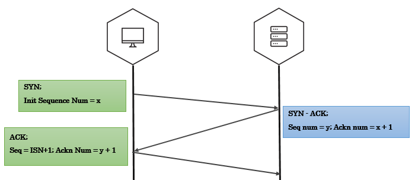
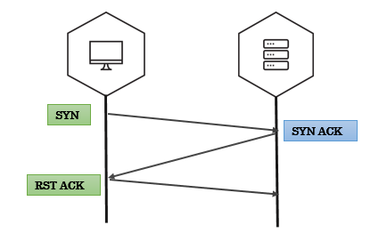
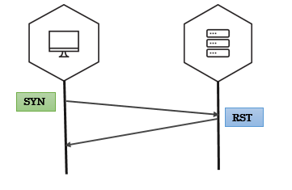
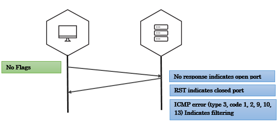
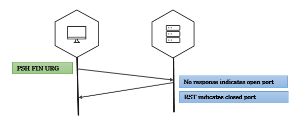
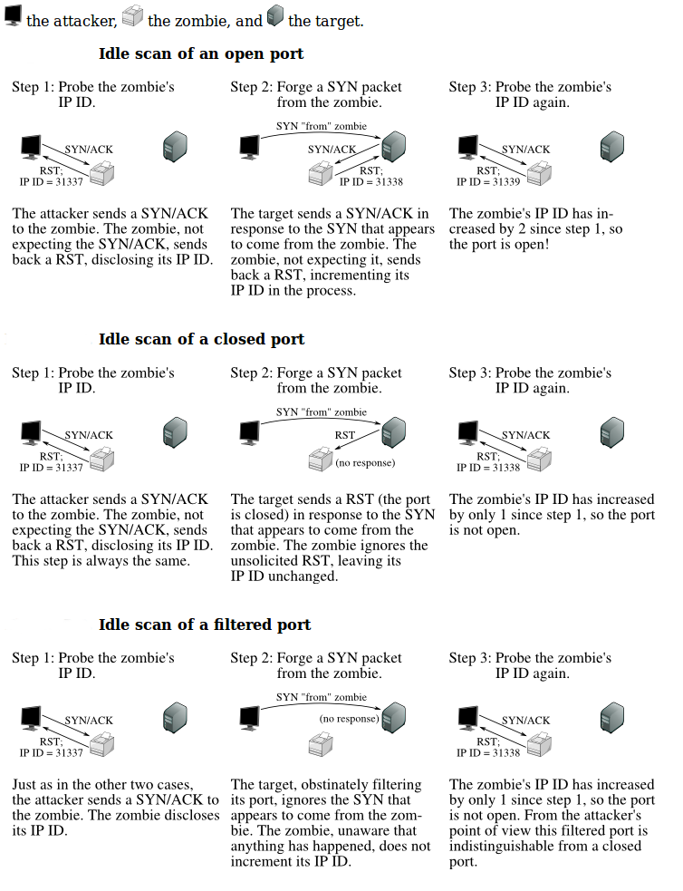

# Service Discovery

## TCP Three way handshake



Three-way handshake captured using tcpdump

```
192.168.56.1.35555 > 192.168.56.102.4444: Flags [S] seq=12345   
192.168.56.102.4444 > 192.168.56.1.35555: Flags [S.],  seq=9998 ack=12346
192.168.56.1.35555 > 192.168.56.102.4444: Flags [.] seq=12346 ack=9999  
```

A note on tcpdump output:

- A port number is appended to the IP address with an additional dot. 192.168.56.1.35555 is IP 192.168.56.1 port 35555.
- An ACK bit is represented by a . so [S.] is SYN-ACK, [.] is ACK.


### Crafting the Three-way Handshake in Scapy

To craft three-way handshake we need to be able to record the response of the server and craft our responses based on server response.

#### Step 1 - Send the client’s SYN to a listening server (SYN)

- Craft an IP header with the source and destination IP addresses.
- Craft a TCP header where we generate the TCP source port, assign the destination port that the server listens on, set the TCP flags to turn the SYN bit on, and generate the client’s ISN.

```
ip=IP(src="10.0.0.1", dst="20.0.0.2")
syn_packet = TCP(sport=1500, dport=80, flags="S", seq=100)
```

#### Step 2 - Listen for the server’s response (SYN - ACK)

- Save the server’s response. (ideally the response should be syn-ack)
- Extract the server’s TCP sequence number and increment the value by one.

```
synack_packet = sr1(ip/syn_packet)
my_ack = syn_ack.seq+1
```

#### Step 3 - Send an acknowledgement from client for server’s response (ACK)

- IP header has the same source and destination as the intial SYN packet.
- TCP header has the same TCP source and destination ports as syn packet, only ACK bit is set, increment the client’s ISN by one since the SYN packet consumes one sequence number, set the acknowledgement value to the incremented server’s sequence number value.

```
ack_packet = TCP(sport=1500, dport=80, flags="A", seq=101, ack=my_ack)
send(ip/TCP_ACK)
```

If everything went right, we have just sucessfully established TCP three-way handshake.

> **Why RST?**
> 
> If you have noticed whenever we recieve a packet, our machine automatically responds with an RST packet.
> 
> The kernel is not aware of what Scapy is doing behind it’s back(Scapy is userland program). If Scapy sends a SYN, the target replies with a SYN-ACK and your kernel sees it as unsolicited packet, it will reply with an RST.
> 
> To prevent this, use local firewall rules (e.g. NetFilter/IPtables for Linux). Scapy does not mind about local firewalls.
>
>       iptables -A OUTPUT -p tcp --tcp-flags RST RST -s 192.168.1.1 -j DROP

## SYN scan






### SYN scan on single target, single port

- We send packets using `sr1` function
- The response is just a single packet
- We use Scapy’s `sprintf` method to print interesting fields in the response. (`SA` flags indicates open ports, `RA` flags indicates closed ports)


```
>>> syn_packet = IP(dst='192.168.56.102')/TCP(dport=4444,flags='S')
>>> resp = sr1(syn_packet)
>>> resp.sprintf('%TCP.src% \t %TCP.sport% \t %TCP.flags%')
'192.168.56.102     4444      SA'
```

### SYN scan on single target, multiple ports

- We use `sr` function to send our packets
- `sr` returns answered probes and unanswered probes that we assign to two variables
- `ans` has all the answered probes in stimulus/response pairs(a tuple)
- We use a simple lambda function to loop over the answered probes and print interesting fields

In the below example, each entry in ans i.e. a stimuli response pair is passed on to a lambda function (stimuli & response as `s`, `r` respectively). Inside lambda function, we use `sprintf` to extract interesting fields.

```
>>> ans, unans = sr(IP(dst="192.168.56.90")/TCP(dport=(20,24),flags="S"))
>>> ans.summary( lambda(s,r): r.sprintf("%TCP.sport% \t %TCP.flags%") )
'ftp_data    RA'
'21          RA
'ssh         SA'
'telnet      RA'
'24          RA'
```

### SYN scan on multiple targets, multiple ports

- `make_table` is an advanced feature in scapy that helps you visualize larger and complex scans
- `make_table` takes three values - for rows, coloumns and the table data

In the below example, target IPs are on x-axis, target ports on y-axis and the TCP flags in response are tabular data.

```
>>> ans,unans = sr(IP(dst=["scanme.nmap.org","egadz.metasploit.com"])/TCP(dport=[10,20,30],flags="S"))
>>>
>>> ans.make_table(lambda(s,r): (s.dst, s.dport,r.sprintf("%TCP.flags%")))

   45.33.32.156 198.58.109.32 
10 RA           SA            
20 RA           SA            
30 RA           SA
```

## Fin scan


### Fin scan on open port - scapy

```
>>> fin_packet = IP(dst='192.168.56.102')/TCP(dport=4444,flags='F')
>>> resp = sr1(fin_packet)
Begin emission:
Finished to send 1 packets.
^C
Received 0 packets, got 0 answers, remaining 1 packets
```

### Fin scan on closed port - scapy

```
>>> fin_packet = IP(dst='192.168.56.102')/TCP(dport=6767,flags='F')
>>> resp = sr1(fin_packet)
>>> resp.sprintf('%TCP.flags%')
'RA'
```

## Null scan



## Xmas scan



## UDP scan


## Exercise time - port scanning

Please solve Exercise 2 - Misc exercises

## IP ID Scan (nmap idle scan)

In 1998, security researcher Antirez posted to the Bugtraq mailing list an ingenious new port scanning technique. Idle scan, as it has become known, allows for completely blind port scanning. Attackers can actually scan a target without sending a single packet to the target from their own IP address! Instead, a clever side-channel attack allows for the scan to be bounced off a dumb “zombie host”. Intrusion detection system (IDS) reports will finger the innocent zombie as the attacker.

Idle scan can be explained in following steps:

- One way to determine whether a TCP port is open is to send a SYN (session establishment) packet to the port. The target machine will respond with a SYN/ACK (session request acknowledgment) packet if the port is open, and RST (reset) if the port is closed. This is the basis of the previously discussed SYN scan.
- A machine that receives an unsolicited SYN/ACK packet will respond with a RST. An unsolicited RST will be ignored.
- Every IP packet on the Internet has a fragment identification number (IP ID). Since many operating systems simply increment this number for each packet they send, probing for the IP ID can tell an attacker how many packets have been sent since the last probe.

By combining these traits, it is possible to scan a target network while forging your identity so that it looks like an innocent zombie machine did the scanning.



## Exercise time - ipidseq & ipidscanner

Please solve Exercise 3 & 4 - Misc exercises
