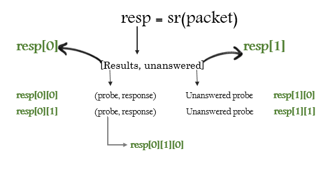
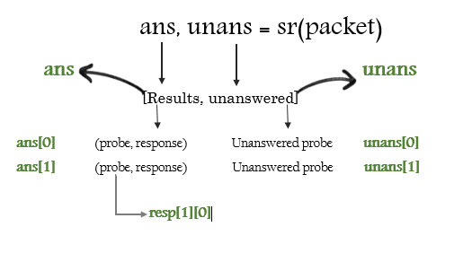

# Send & Recieve Packets

- Send & recieve funtions are the heart of scapy’s functionality

> Most scapy funtions like `send()`, `sniff()` functions has fine grain options like applying bpf filters, timeout, retry, verbosity etc. Use `help(function_name)` to find out more options.

## send()

- Send packets at Layer 3(Scapy creates Layer 2 header), Does not recieve any packets.
- `loop` argument is by default 0, if it’s value is anything other than 0 then the packets will be sent in a loop till CTRL-C is pressed
- `count` can be used to set exact number of packets to be sent.
- `inter` can be used to set numbers of seconds between each packet.

```
>>> send(IP(dst='8.8.8.8')/TCP(dport=53, flags='S'))
.
Sent 1 packets.
>>> 
>>> send(IP(dst=['8.8.8.8', '8.8.8.4'])/TCP(dport=53, flags='S'))
..
Sent 2 packets.
>>>
>>> send(IP(dst='8.8.8.8')/TCP(dport=53, flags='S'), count=10)
..........
Sent 10 packets.
>>>
>>> send(IP(dst='8.8.8.8')/TCP(dport=53, flags='S'), loop=1)
......................... [... snipped ...]
Sent 1503 packets.
```

## sendp()

- Same as `send()` but sends packets at Layer 2 (Must provide Layer 2 header), does not recieve any packets
- Use `iface` to set interface to send packets on. (If not set `conf.iface` value will be used)

```
>>> sendp(Ether()/IP(dst="1.2.3.4",ttl=(1,4)), iface="eth1")
....
Sent 4 packets.

>>> sendp("I’m travelling on Ethernet", iface="eth1", loop=1, inter=0.2)

>>> sendp(rdpcap("/tmp/pcapfile")) # tcpreplay
...........
Sent 11 packets.
```

## sr()

- Sends packets and receiving answers.
- `sr()` returns a two lists, first list contains stimulus-response couple(like a tuple), and the second list contains the unanswered probes

```
>>> sr(IP(dst="192.168.8.1")/TCP(dport=[21,22,23]))

Received 6 packets, got 3 answers, remaining 0 packets
(<Results: UDP:0 TCP:3 ICMP:0 Other:0>, <Unanswered: UDP:0

>>> ans,unans=_
>>> ans.summary()
```





## sr1()

Sends all the stimulus and records only the first response.

```
>>> p=sr1(IP(dst="scanme.nmap.org")/ICMP()/"XXXXXXXXXXX")
Begin emission:
...Finished to send 1 packets.
.*
Received 5 packets, got 1 answers, remaining 0 packets
```

## srloop()

- Sends stimulus, recieves responses and displays responses, in a loop.
- The function returns a couple of packet and answers, and the unanswered.

```
>>> packet = IP(dst='192.168.56.102')/ICMP()
>>> srloop(packet)
RECV 1: IP / ICMP 192.168.56.102 > 192.168.56.1 echo-reply 0
RECV 1: IP / ICMP 192.168.56.102 > 192.168.56.1 echo-reply 0
RECV 1: IP / ICMP 192.168.56.102 > 192.168.56.1 echo-reply 0
^C        
Sent 3 packets, received 3 packets. 100.0% hits.
(<Results: TCP:0 UDP:0 ICMP:3 Other:0>, <PacketList: TCP:0 UDP:0 ICMP:0 Other:0>)
```


> The loopback interface is a very special. Packets going through it are not really assembled and dissassembled
> 
> The kernel routes the packet to its destination while it is still stored an internal structure. The kernel is not aware of what Scapy is doing behind his back, so what you see on the lo interface is also a fake. Except this one did not come from a local structure. Thus the kernel will never receive it.
> 
> To speak to local applications, you need to build your packets one layer upper, using a PF_INET/SOCK_RAW socket > instead of a PF_PACKET/SOCK_RAW (or its equivalent on other systems that Linux).
